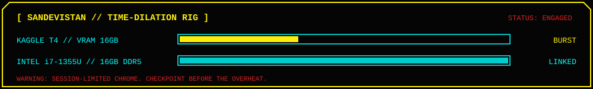

 

<table width="100%" bgcolor="#050505" border="2">
  <tr>
    <td bgcolor="#050505">
<pre>
<b>root@netrunner:~# define netrunner</b>

netrunner (n.)  someone who jacks into the Net, bends it, and
                walks out with what they came for.

in my case:     I jack into models and data. I train them, strip them
                down, break them on purpose, and measure exactly when
                they can still be trusted.

<b>root@netrunner:~# whoami</b>
vishwanath  //  handle: Vishwanath-06  //  class: NETRUNNER  //  mode: SOLO
</pre>
    </td>
  </tr>
</table>

<table width="100%" bgcolor="#050505" border="2">
  <tr><td><code>CYBERDECK</code></td><td>M2 deck, plus a Kaggle T4 (16 GB VRAM) as my Sandevistan: short bursts of borrowed speed</td></tr>
  <tr><td><code>CHROME</code></td><td>Undergrad, CSE (AI/ML). Neural nets, spiking nets, conformal guarantees, agents</td></tr>
  <tr><td><code>CONTRACT LENGTH</code></td><td>4 to 8 months per op. Scope it, ship it, write it up</td></tr>
  <tr><td><code>DESTINATION</code></td><td>The Moon. In my case, IEEE conference proceedings</td></tr>
</table>

 

 

<table width="100%">
  <tr>
    <th width="34%" align="center"><code>[ NEURAL_CORES ]</code></th>
    <th width="33%" align="center"><code>[ CLOUD_UPLINKS ]</code></th>
    <th width="33%" align="center"><code>[ CYBER_OPTICS ]</code></th>
  </tr>
  <tr>
    <td align="center" valign="top">
       
       
       
      
    </td>
    <td align="center" valign="top">
       
      
    </td>
    <td align="center" valign="top">
       
      
    </td>
  </tr>
</table>

 

<table width="100%">
  <tr>
    <th align="left">[ DAEMON ]</th>
    <th align="left">[ EFFECT ]</th>
    <th align="left">[ SOURCE ]</th>
  </tr>
  <tr><td><code>PULSE.exe</code></td><td>Reads heart rhythms and flags arrhythmia</td><td><a href="https://github.com/Vishwanath-06/PulsePod">PulsePod</a></td></tr>
  <tr><td><code>BRIDGE.exe</code></td><td>Translates whole Indic-language documents</td><td><a href="https://github.com/Vishwanath-06/BhashaSethu">BhashaSethu</a></td></tr>
  <tr><td><code>PRUNE.exe</code></td><td>Strips weights until the model starts to hurt</td><td><a href="https://github.com/Vishwanath-06/Sparse-Neural-Nets">Sparse-Neural-Nets</a></td></tr>
  <tr><td><code>GHOST.exe</code></td><td>Retrieval and generation with the uplink cut</td><td><a href="https://github.com/Vishwanath-06/Offline_RAG">Offline_RAG</a></td></tr>
  <tr><td><code>CALIBRATE.exe</code></td><td>Sets alarm thresholds you can trust, with conformal guarantees</td><td>Research op 03</td></tr>
  <tr><td><code>RECOVER.exe</code></td><td>Gets an LLM agent back on mission after a tool fails</td><td>Research op 01</td></tr>
</table>

 

<table width="100%" bgcolor="#050505" border="2">
  <tr>
    <td bgcolor="#050505">
<pre>
<b>root@netrunner:~# cat current_ops.txt</b>

OP_01  BUGGED_CHROME        LLM agent tool-failure recovery
OP_02  NIGHT_CITY_GRID      Dynamic graph transformers
OP_03  CYBERPSYCHOSIS_WATCH Conformal thresholds for visual anomaly
                            detection under drift (MVTec-AD)
OP_04  CHROME_CRASH_PREDICT Spiking nets for seizure prediction (CHB-MIT)

<b>root@netrunner:~# echo $TARGET</b>
THE_MOON  // IEEE conference proceedings

<b>root@netrunner:~# _</b>
</pre>
    </td>
  </tr>
</table>

Open a file to read the briefing:

<code>cat ops/OP_01_BUGGED_CHROME.log</code>

 

Agents live and die by their tools. APIs time out, calls return garbage, schemas change mid-run. This op is about what an LLM agent does **after** a tool fails: notice it, recover, and keep the mission alive instead of looping or hallucinating a result.

<code>cat ops/OP_02_NIGHT_CITY_GRID.log</code>

 

Real networks rewire. Nodes join, edges decay, the topology you trained on is gone by tomorrow. Dynamic graph transformers are how I'm studying models that keep up with a grid that never holds still.

<code>cat ops/OP_03_CYBERPSYCHOSIS_WATCH.log</code>

 

Cyberpsychosis is a system drifting past its threshold without noticing. The research version: a visual anomaly detector on MVTec-AD with a frozen WideResNet-50 backbone, an alarm threshold set with conformal methods, and no labels to check it against. Can that threshold be trusted when the data drifts and nobody is annotating?

<code>cat ops/OP_04_CHROME_CRASH_PREDICT.log</code>

 

A spiking-network framework that predicts seizures on CHB-MIT, like a ripperdoc's early warning before the chrome crashes the brain. Energy claims stay honest: I report SynOps and spike sparsity as simulation proxies and make no hardware-performance claims.

 

<table width="100%">
  <tr>
    <td width="50%"></td>
    <td width="50%"></td>
  </tr>
  <tr>
    <td width="50%"></td>
    <td width="50%"></td>
  </tr>
  <tr>
    <td width="50%"></td>
    <td width="50%"></td>
  </tr>
</table>

 

 

 

 

 

Got a research idea, a collab, or a question about one of the ops? Pick a channel. Each button opens a pre-filled issue on this repo.

 

<code>SYS.SHUTDOWN // "Built different."</code>

